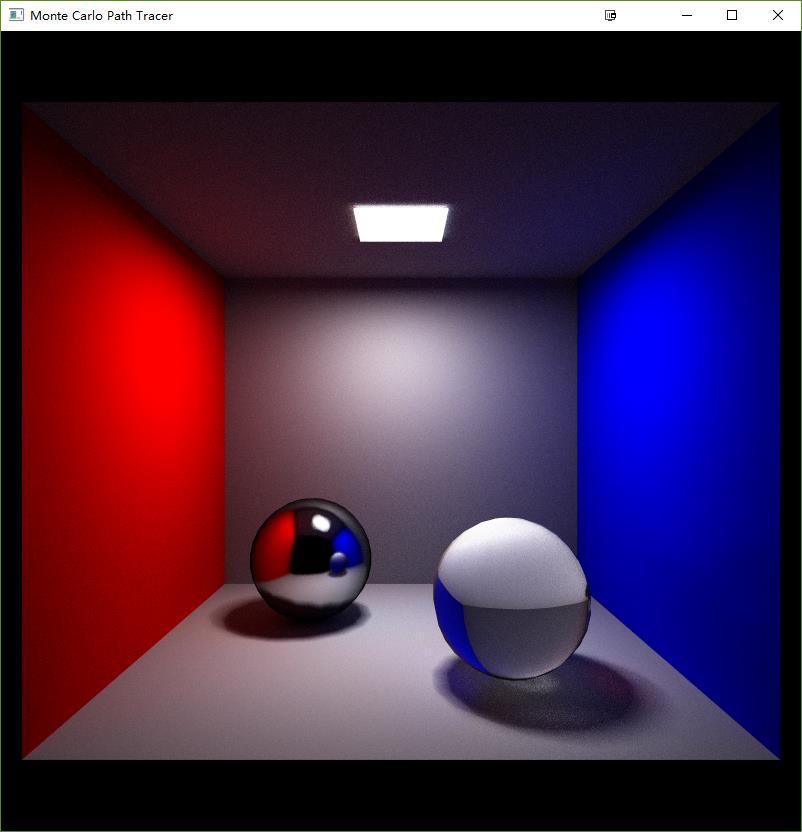
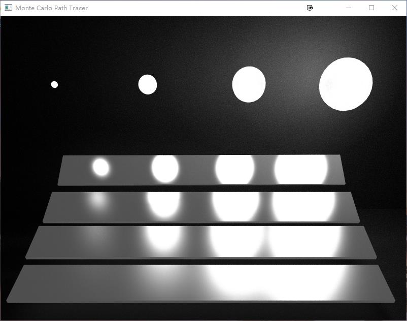
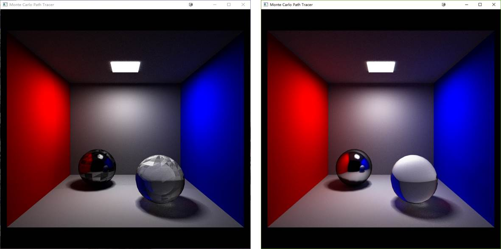
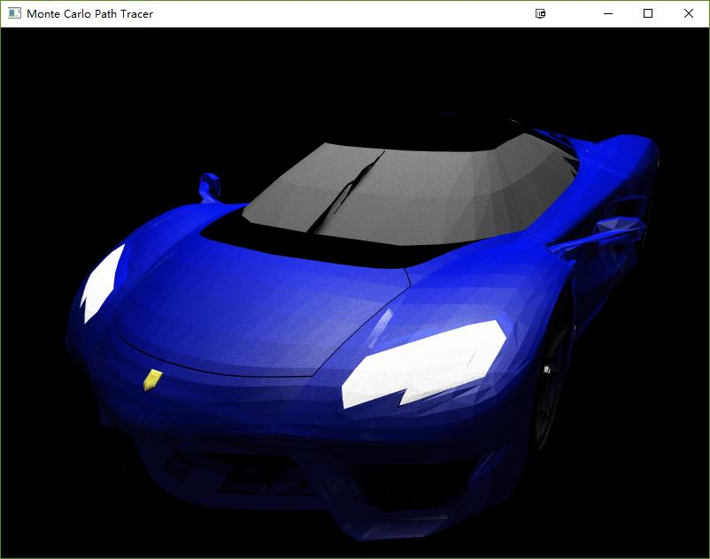

## 内容及要求

- 不使用现有API，编程实现基于Monte Carlo 的Path Tracing算法；
- 输入为obj格式的模型文件和mtl的材质文件；
- 输出为由glut提供的显示窗口。随着迭代次数的增加，绘制场景的噪声逐步减少；
- 实现了高光反射、漫反射和折射等效果，实现了简单场景的绘制。

## 开发环境
- 操作系统：Win10 x64
- 计算机配置：Intel i7-6700 CPU(3.4GHz)，内存：DDR4 8G
- IDE: Microsoft Visual Studio 2013 x86
- 依赖库：GLUT(用于用户界面设计)
- 说明：只配置了VS2013 x86工程，GLUT在x64工程中存在问题，因此没有配置

## 软件使用说明

### 程序启动
运行Win32 Release工程(双击Release目录下的MonteCarloPathTracer.exe)，程序启动，默认加载解决方案下models路径中的scene01.obj模型文件，并使用Monte Carlo Path Tracing算法对所加载模型进行绘制，其迭代的最终结果如图1所示。在命令窗口中输出显示窗口的大小和当前模型绘制迭代的次数。图2为scene02.obj的绘制结果。

<b>图1</b> scene01 模型的绘制结果

<b>图2</b> scene02 模型的绘制结果

## 数据结构说明

为了使得程序具有良好的层次性，采用了C++面向对象的编程。程序根据不同阶段的需求，设计了如下类，并对其需要完成的功能和特点进行了说明：

- Vec类：主要用于表达颜色、位置等三维向量数据；
- Geometry类：用于表示三位模型中的基元，是后面Triangle、Model和KdTree类的基类，实现了多态性，使得上述几个类具有统一性，方便后续kd树的构造；
- Triangle类：用于表示三角面片，包括三角形的1个顶点、2条边和三角面片的法线方向，并且提供了跟踪光线和三角面片进行求交的接口；
- Model类：主要用于加载obj文件中的模型，其成员包括模型顶点、模型面、面法线和材质等。为了处理方便，其模型面片都转化为三角面片Triangle对象。整个模型是由三角面片构成的网格组成；
- Material类：主要用于加载mtl文件中的材质属性，包括ka, kd, ks和emission等属性；
- Light类：用于表示场景中的光源，用于实现场景绘制中的直接光照，加快场景绘制收敛的速度(在光源有限的情况下)；
- Ray类：表示Path tracing算法中的光线，其主要成员变量包括光线产生的来源（反射、折射等）、光线的起点、光线的方向；
- AABB类：主要用于表示三角面片Triangle、Model的包围框，配合KdTree将三维模型表示为树状层次结构；
- KdTree类：主要用于将三位模型/场景表示为层次状数据结构，从而加速光线与模型的求交；
- Camera类：表示摄像头，用于决定场景需要显示部分的视角，其成员变量主要包括相机所在位置、相机的朝向和相机的放置角度和相机的视场；
- Scene类：用于表示场景，确定了需要显示场景的方式，其主要成员变量包括三维模型、光源和相机；
- PathTracer类：实现路径跟踪算法， 其功能是根据场景Scene中的内容，在生成画面的视景体内的每一个像素点随机产生一系列光线Ray，这些光线Ray在场景中进行折射反射，其光线进行累加后得到所需绘制的结果。
- Display类：主要用于三维模型的显示，并且更具路径跟踪算法不断迭代更新的绘制结果，更新显示的画面。

## 加速说明

本文程序根据路径跟踪算法的特点，进行了如下加速：

- 采用了直接光照，也就是在进行采样之前，先对场景中的光源进行遍历，来计算交点的直接光照。这样就可以通过少量的采样，即可以获得一个比较明亮的绘制结果，再在这个基础上进行光线跟踪绘制，可以使得绘制结果快速收敛到真实的场景效果上。
- 本文在光线求交的过程中，使用了kd树数据结构进行加速。本文将整个场景中的模型构建成一个由包围盒组成的层次化的树状结构。通过光线与包围盒的简单求交，以判断是否需要进一步与场景进行求交，可以避免大量与场景不存在交点的光线求交，从而提高了路径跟踪算法中大量存在的求交运算的效率，使得算法的效率大幅度提升。
- 在光线采样时，取SPP为1，也就是每个像素点只采样一条光线，从而绘制得到一帧图像（绘制场景比较粗糙），接着以相同的方式再产生一帧新的图像，并与前面几帧进行平均，作为新的绘制结果。由于多次采样并平均，可以有效的消除随机采样产生的噪点，从而使得绘制结果好于上一帧。通过上述迭代过程，迭代达到一定的次数之后，生成最终的绘制结果。这样进行处理，与一般方法(每个像素进行多次采样，例如SPP=100，最终生成绘制结果)相比较，可以及时得到绘制结果，并且中间结果可见，用户不需要不必的等待。这种方法对100帧进行平均得到的结果等价于采用SPP=100的一般方法，但是在显示的效率上远高于一般方法。其迭代过程如图3所示，从左往右分别表示迭代1次、25次、50次和100次的结果，其绘制真实感逐步增加。

<b>图3</b> scene01迭代过程

- 利用OpenMP对路径跟踪算法进行循环加速。在路径跟踪算法中，不同像素点之间的光线跟踪是相互独立的，并不存在依赖关系，因此可以进行并行计算。利用OpenMP可以很好地支持程序编译成多核并行代码，从而充分利用多核CPU的硬件资源，实现路径跟踪算法的加速。

## 总结

在程序调试的过程中遇到了很多问题，其中一个问题很难发现原因所在。在scene01的2个球上出现了很多暗块，其表现如图4左图所示。后来进行了单步调试，我才发现路径跟踪的过程中出现了光线反射后的交点和前一个交点的距离只有10-6。这时，我猜想可能是老师上课提到的浮点误差。于是，我在光线起点与场景交点的距离上设置了容忍误差为10-5。这时，我得到了如图4右图所示结果。

<b>图4</b>浮点误差引起的Bug

对于scene02，其绘制结果如图2所示，与标准程序的绘制结果对比，存在较大的差距，我在材质文件中增加了Ke属性，使得球光源能够自发光，并且修改了Ns参数，使其具有比较明显的高亮效果。但是仍然与标准程序的结果存在差异。我认为有可能是材质文件(mtl文件)存在问题。另外因为路径跟踪中应用了直接光照，对于scene02的绘制速度比较慢。

## 附录：其他场景的运行结果

<b>图5</b>sportsCar模型的绘制结果

<b>图6</b>CornellBox-Glossy模型的绘制结果

